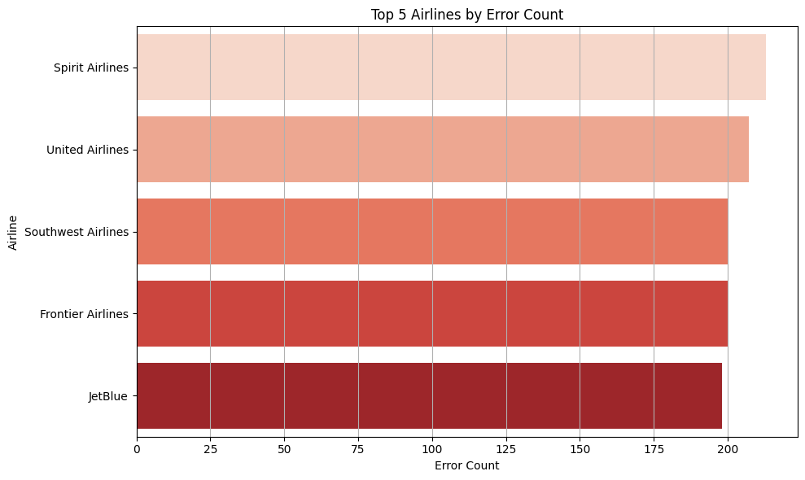
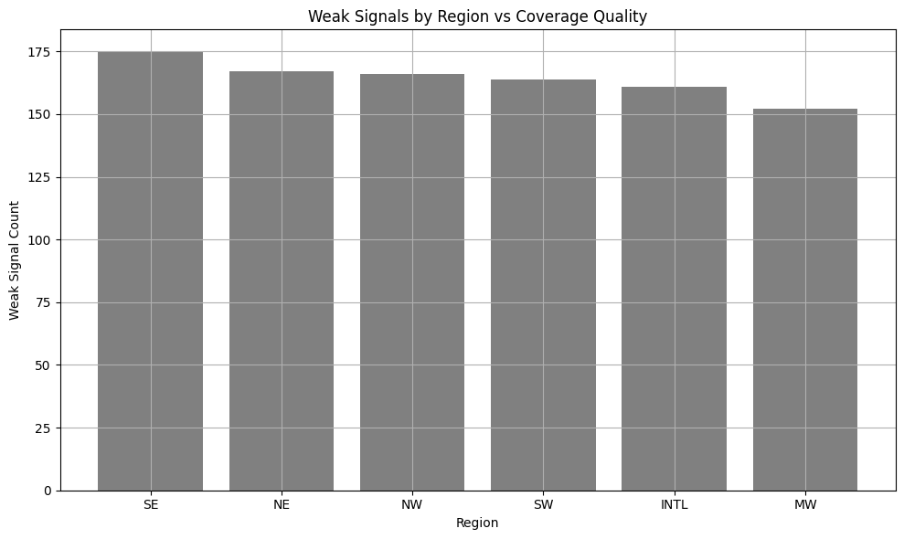
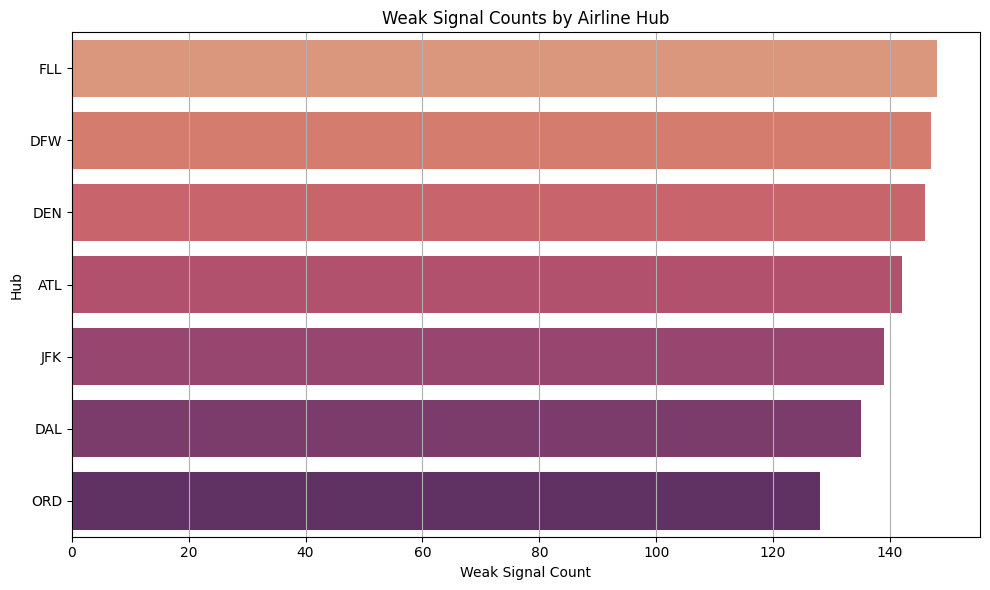
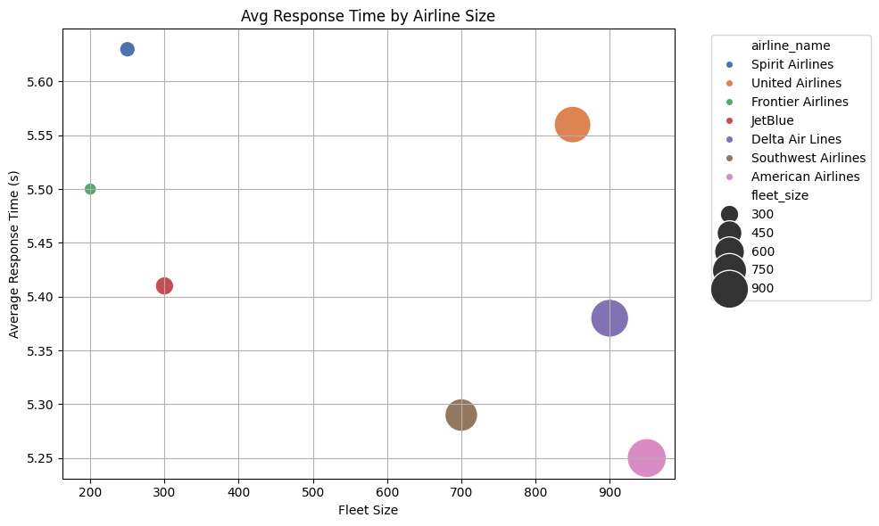

# ✈️ AirComm Insight Engine

**A data-driven simulation of GLOBALink-style aircraft communication performance monitoring and failure prediction.**

---

## 📌 Project Overview

The **AirComm Insight Engine** is a portfolio project built to simulate and analyze the performance of an aircraft-ground communication system, inspired by Collins Aerospace's GLOBALink infrastructure.

This system ingests simulated ACARS-style logs, joins aircraft metadata, analyzes weak signal zones, and uses machine learning to **predict communication errors**.

---

## 🎯 Key Features

- 📊 **SQL Analysis** of aircraft logs, fleet models, and RF degradation zones
- 📉 **Root Cause Detection** via signal strength and response time diagnostics
- 🤖 **Machine Learning** (Logistic Regression & XGBoost) to predict failure risk
- 📡 Simulated behavior of **ACARS, CPDLC, and VDL** systems
- 📈 **Dashboard-ready charts** using Seaborn & Matplotlib
- 📁 Organized and documented for real-world application

---

## 🧠 Background & Problem

Aircraft-ground communication systems like **ACARS** and **CPDLC** are critical for real-time coordination between aircraft and aviation authorities. Failures or delays in these systems can disrupt operations or compromise safety.

This project emulates these challenges by:
- Tracking signal strength (< -90 dBm thresholds)
- Logging aircraft-level errors and response delays
- Aggregating insights by **airline**, **fleet model**, and **region**

---

## 📊 Visual Insights

### 🚨 Top 5 Airlines by Error Count

**Insight:** Spirit and United Airlines experienced the most errors, possibly due to fleet model or hub coverage limitations.


### 📡 Weak Signal Zones by Hub


### 📡 Weak Signal Zones by Airline Hub

⚠️ Hubs like FFL and DFW show disproportionately high counts of weak signal events (< -90 dBm), suggesting potential RF dead zones or infrastructure issues

### 🚨 Avg response time by Airline Size


### 🔍 Insight Highlights:
Airlines with larger fleets (e.g., American, Delta) show lower average response times, indicating possible investment in robust RF infrastructure and well-optimized ACARS handling.

Regional carriers or smaller fleets tend to have higher average response times, possibly due to older aircraft, less centralized ground infrastructure, or coverage gaps in their primary hubs.

These trends suggest a potential performance scalability effect — larger fleets may benefit from more standardized comm systems.

### 📈 Top 10 Region vs Error Events – By Models
.png)


### 📈 Top 10 Region vs Error Events – Heatmap
.png)
### 🔍 Insight Highlights:
B737-MAX and A321 show high error counts in the NE and SouthWest, likely due to regional RF coverage issues or high fleet volume in those areas.

A321 errors are concentrated in the Northeast, possibly linked to fleet age or hub congestion.

Regional differences may reflect variations in ground infrastructure, terrain interference, or equipment compatibility with VDL/ACARS protocol

### 📈 Feature Importance – XGBoost Model

### 📌 **Top 15 Features** used in predicting comm failures.  
- Signal strength and region dominate importance.  
- Fleet size and model also contribute to risk classification.
---

## 🔍 Machine Learning

Two classification models were trained to predict whether a flight would encounter a communication error:
- Logistic Regression
- XGBoost

### ✅ Performance Summary

| Model               | Accuracy | Precision | Recall | F1 Score |
|--------------------|----------|-----------|--------|----------|
| Logistic Regression| 55%      | 0.55      | 0.95   | 0.70     |
| XGBoost            | 49%      | 0.54      | 0.58   | 0.56     |

> 🔧 Feature engineering and class balancing are planned as next steps.

---
### 📊 Classification Report – Logistic Regression (Aircraft Error Prediction)


---

### 🧠 Interpretation

#### 🔹 Class 0 – "No Error"
- **Precision (0.36):** When the model predicted no error, it was correct 36% of the time.
- **Recall (0.04):** It only identified 4% of the actual no-error flights — indicating **many false positives**.

#### 🔹 Class 1 – "Error"
- **Precision (0.55):** When predicting an error, it was correct 55% of the time.
- **Recall (0.95):** It correctly flagged 95% of real error cases — **very strong recall** for failure detection.

#### 🎯 Overall Accuracy: **55%**
- This model performs slightly better than chance, but heavily **biased toward catching errors**.
- Likely due to **class imbalance** or model overfitting.

---

### ✅ Summary

> “This model prioritizes recall for error cases — valuable for a safety-critical system like aircraft communications. However, it struggles to identify clean flights, which may cause operational noise or alert fatigue. I would improve this with class balancing or an XGBoost model tuned for precision-recall tradeoffs.”

### 📊 Classification Report – XGBoost (Aircraft Error Prediction)


---

### 🧠 Interpretation

#### 🔹 Class 0 – "No Error"
- **Precision (0.41):** When the model predicted no error, it was correct 41% of the time.
- **Recall (0.37):** It correctly identified 37% of flights that had no errors.
- 📉 The model struggles to distinguish clean flights, which can result in many false positives.

#### 🔹 Class 1 – "Error"
- **Precision (0.54):** When predicting an error, it was correct 54% of the time.
- **Recall (0.58):** It successfully caught 58% of all real errors.
- ✅ Slightly better performance for the error class, but recall and precision could still be improved.

#### 🎯 Overall Accuracy: **49%**
- The model is performing close to random guessing — indicating that **features or model tuning needs improvement**.

---

### ✅ Summary

> “The XGBoost model outperformed Logistic Regression slightly on precision and recall for error detection, but overall accuracy remains low (49%).  
>
> It captures more failure events than random chance, but still produces many false positives and misses clean flights.  
>
> I would next improve the signal-to-noise ratio through:
> - Feature engineering
> - Class balancing (SMOTE or undersampling)
> - Hyperparameter tuning or model stacking”

## 🧰 Tech Stack

- Python (`pandas`, `scikit-learn`, `xgboost`, `matplotlib`, `seaborn`)
- SQL (via `sqlite3`)
- Data Preprocessing (`StandardScaler`, `OneHotEncoder`)
- Dashboards (Tableau-ready structure and notebook visualizations)
- Jupyter Notebook & Markdown

---

## 📁 Project Structure

```bash
aircomm-insight-engine/
│
├── data/                         # Source CSVs and SQLite database
├── images/                       # Charts and visuals for README
├── notebooks/                    # Jupyter notebooks with analysis
├── models/                       # Saved ML model objects (optional)
├── README.md
├── requirements.txt
└── aircomm_dashboard_template.ipynb

# Create virtual environment
python -m venv aircomm
source aircomm/bin/activate  # On Windows: venv\Scripts\activate

# Install dependencies
pip install -r requirements.txt

# Launch the notebook
jupyter notebook notebooks/aircomm_dashboard_template.ipynb

 
```

## 📣 Author

👨‍💻 **Maurice J. Colon**  
Data Analyst & Systems Engineer in Training  

[](https://www.linkedin.com/in/maurice-j-colon-064385152/)
[](https://github.com/mjcolon218)


